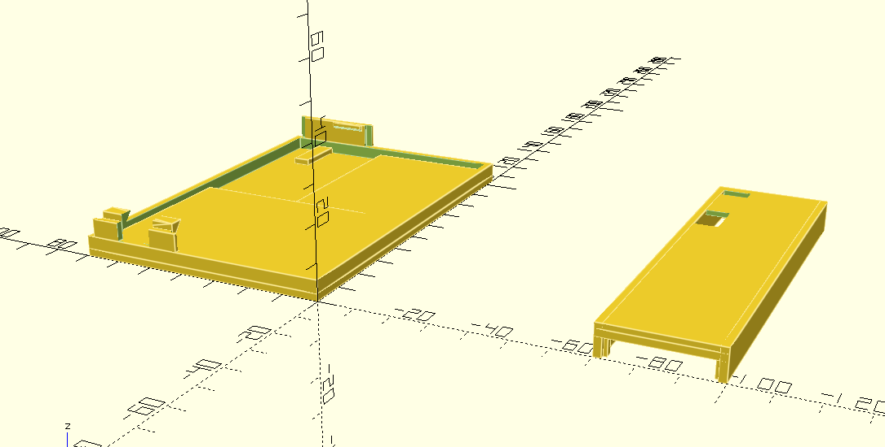
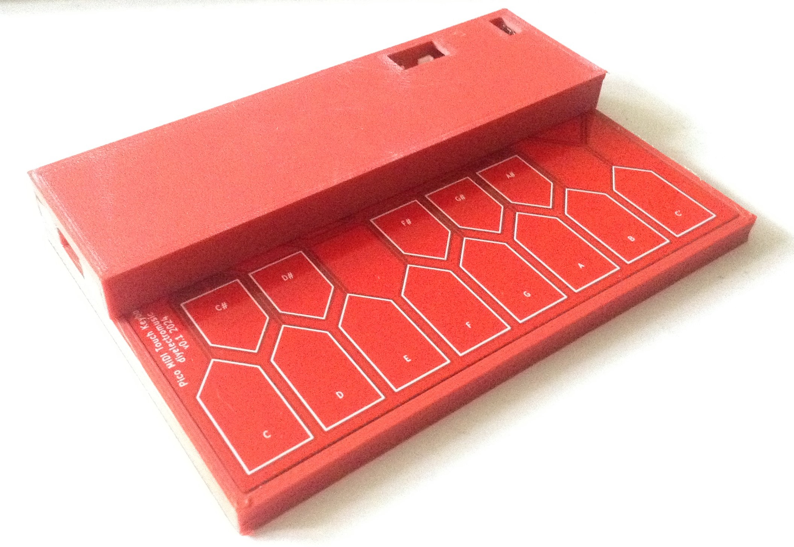
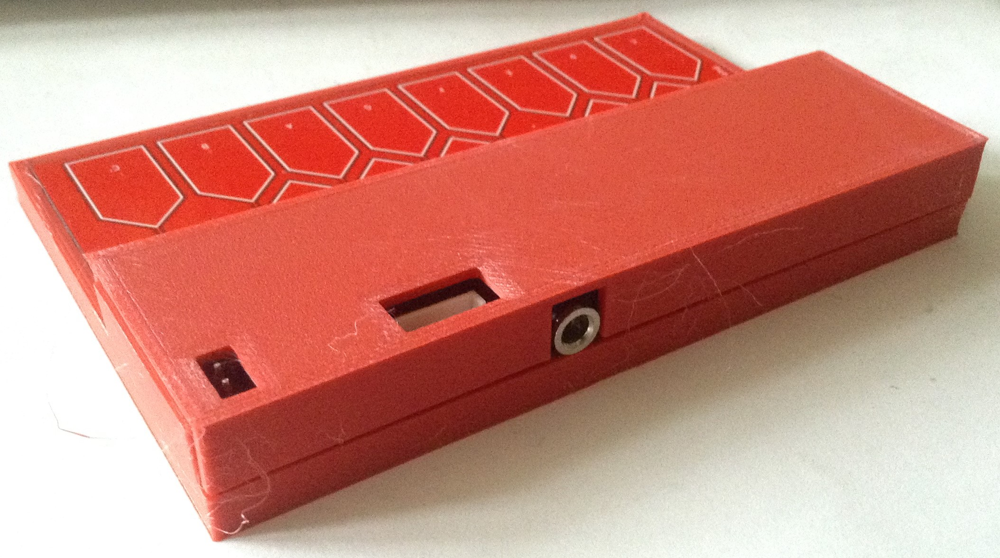

# Simple 3D Printable Case

Two STL files for a two-part case for the Pico Touch Keyboard.

|  |  |

Notes:
* There are two parts, a base and top.
* They snap together, but it isn't particularly strong, but it was good enough for me.
* The top needs turning upside down for slicing/printing.

If you like what you see, you can buy me a Ko-Fi - https://ko-fi.com/diyelectromusic

#  A Word of Caution!

Please note - I consider myself a novice at 3D design!  This was good enough for me.

**Don't spend your own time and resources on any of these designs without knowing what you are doing.  They are not "off the shelf products" ready to go!**

# License

All information is provided AS IS with no implied fit for purpose as detailed in the included MIT License.

All content and code (c) diyelectromusic (Kevin)
